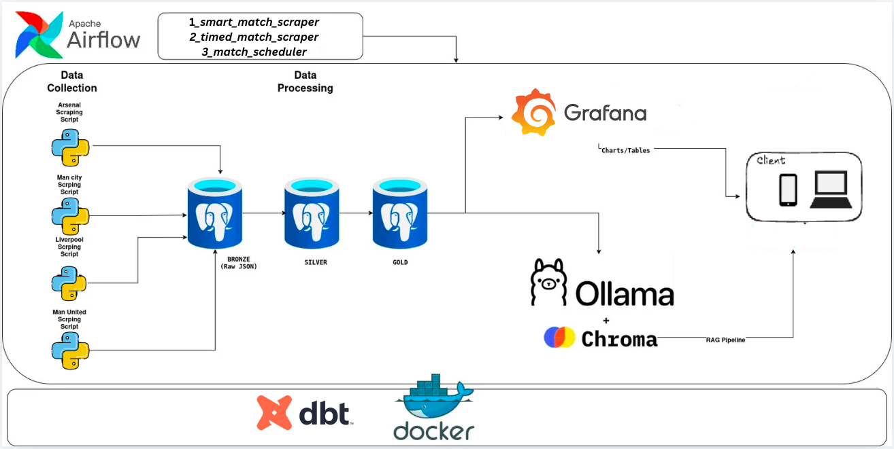

# Arsenal Analytics Platform

> **Production-ready football analytics platform** with AI-powered chatbot, interactive dashboards, and fully automated data pipelines.

[](https://www.python.org/)
[](https://www.postgresql.org/)
[](https://airflow.apache.org/)
[](https://www.getdbt.com/)
[](https://ollama.com/)
[](https://www.trychroma.com/)
[](https://www.docker.com/)

---

##  Project Architecture
The platform is built on a modern data stack designed for high-frequency data ingestion, multi-layered processing, and AI-driven insights.


### 1. Data Acquisition (Automated Scraping)
*   **Orchestration**: Managed by **Apache Airflow** with custom Python Operators.
*   **Stealth Scraping**: Uses **Playwright** paired with **Xvfb (Virtual Display)** to bypass advanced anti-bot measures (Cloudflare/TLS Fingerprinting) on FBref and Understat.
*   **Sources**: High-fidelity match statistics, shot maps, lineups, and advanced metrics (xG, xA, SCA).

### 2. Storage Layer (Medallion Architecture)
Data is organized in a PostgreSQL data warehouse across three primary tiers:
*   **Bronze (Raw)**: Persistent landing zone for raw JSON and HTML responses.
*   **Silver (Staged)**: Cleaned, validated, and normalized relational tables.
*   **Gold (Analytics)**: Optimized views and metrics for dashboards and RAG.

### 3. Data Transformation (dbt)
*   **ELT Workflow**: Uses **dbt (data build tool)** to transform raw Bronze data into Silver and Gold layers.
*   **Version Control**: SQL-based transformations with testing, documentation, and lineage tracking.
*   **Modeling**: Implements modular SQL for reusable business logic and performance optimization.

### 4. Intelligence Layer (RAG & AI)
*   **Engine**: A **FastAPI** backend powering a Hybrid-Intelligence Chatbot.
*   **RAG (Retrieval-Augmented Generation)**: Uses **ChromaDB** as a vector store to index match reports and tactical insights.
*   **Local LLM**: Orchestrated by **Ollama**, running models like `qwen2.5` locally for data privacy and low latency.
*   **Hybrid Search**: Combines direct SQL queries (for aggregate stats) with vector search (for semantic/tactical analysis).

### 5. Observability & Visualization
*   **Dashboards**: (External) Interactive visualizations for tactical analysis.
*   **Monitoring**: **Prometheus** and **Grafana** track system health, scraping success rates, and database performance.

---

##  Technology Stack

*   **Backend**: Python 3.11, FastAPI
*   **Orchestration**: Apache Airflow
*   **Transformation**: dbt (Data Build Tool)
*   **Database**: PostgreSQL 16
*   **AI/ML**: Ollama (LLM), ChromaDB (Vector DB), Sentence-Transformers
*   **Infrastructure**: Docker, Docker Compose
*   **Monitoring**: Prometheus, Grafana

---

##  Getting Started

1.  **Clone the repository**:
    ```bash
    git clone https://github.com/EbEmad/Analytics-Platform.git
    cd Analytics-Platform
    ```
2.  **Start the platform**:
    ```bash
    docker-compose up -d
    ```
3.  **Access the services**:
    *   **Airflow**: `http://localhost:8080`
    *   **Chatbot API**: `http://localhost:5000`
    *   **Grafana**: `http://localhost:3000`

---
