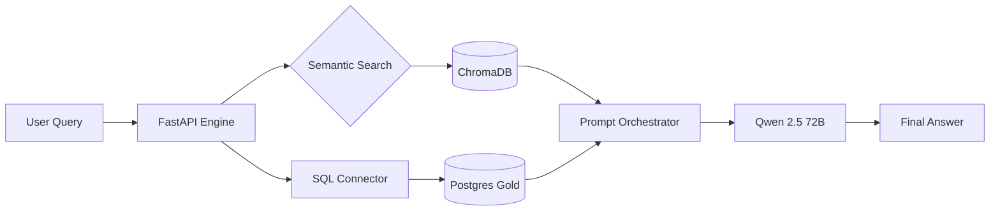
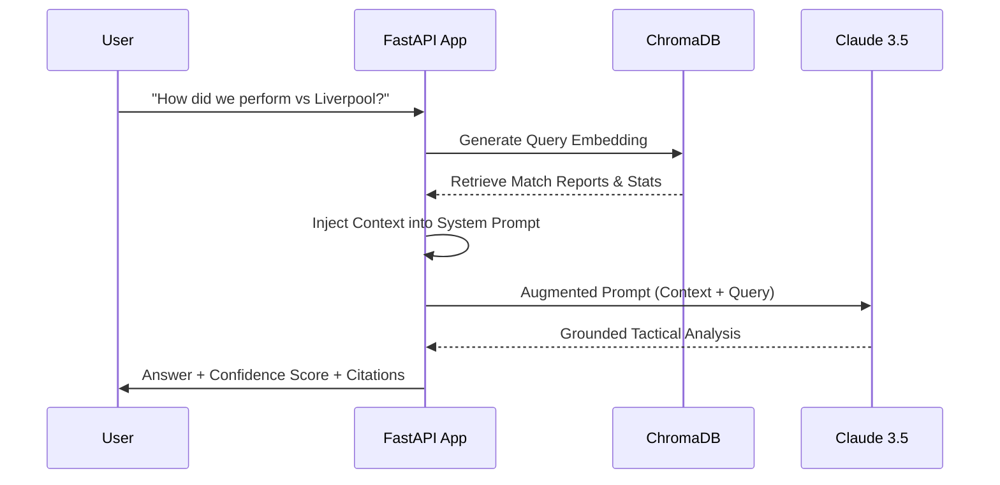

# Arsenal Tactical RAG Analyst
> **Data-driven football intelligence powered by Qwen 2.5 and Retrieval-Augmented Generation.**

The Arsenal RAG Analyst is a high-performance microservice that enables natural language querying over thousands of match events. It bridges the gap between a PostgreSQL data warehouse and local LLM orchestration to provide verifiable, grounded tactical insights.

---

##  Architecture & Flow

##  RAG Pipeline Flow



---

## Tech Stack
- **LLM Engine**: Ollama (Running `qwen2.5:72b`)
- **RAG Orchestration**: LangChain
- **Vector Store**: ChromaDB (`all-MiniLM-L6-v2` embeddings)
- **Backend**: FastAPI
- **Data Source**: PostgreSQL 16

---

##  Setup
1. **Initialize Vector Store**:
   ```bash
   curl -X POST http://localhost:5000/rebuild-embeddings
   ```
2. **Query the Analyst**:
   ```bash
   curl -X POST http://localhost:5000/chat -H "Content-Type: application/json" \
     -d '{"question": "How did Arsenal perform in their last home match?"}'
   ```

---

##  Key Components
- `rag/chain.py`: Orchestrates the retrieval and LLM invocation via Ollama.
- `rag/embeddings.py`: Manages ChromaDB indexing and similarity search.
- `utils/db_connector.py`: Fetches high-fidelity match data from PostgreSQL.
- `system_prompts/`: Defines the domain-specific "Tactical Analyst" persona.

---

##  Recruiter Focus
- **Grounding & Reliability**: Virtually eliminates hallucinations by grounding all LLM responses in real match data.
- **Local Sovereignty**: Uses self-hosted models (Ollama) for data privacy and reduced latency.
- **Hybrid Intelligence**: Combines structured SQL results with unstructured semantic context for comprehensive analysis.